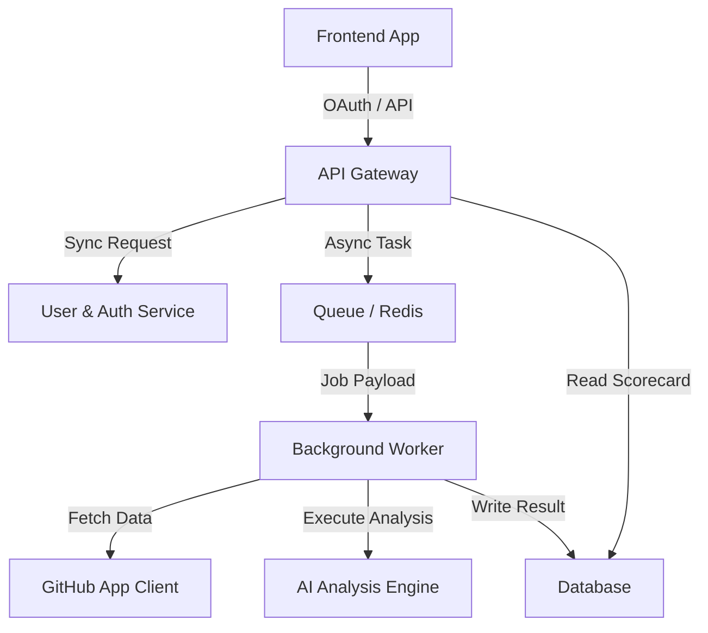
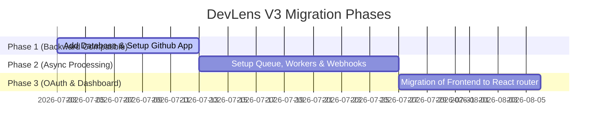

# 🔍 DevLens V3: Architectural Review & Platform Proposal

This document outlines the comprehensive architectural transition of **DevLens** from a prototype/single-use AI auditor into a highly scalable, multi-tenant Developer Platform ready for the **GitHub Developer Program** and **GitHub Marketplace**.

---

## 1. Current Architecture (V2)

### 📂 Folder Structure
The project is currently structured as a simple monorepo optimized for quick deployments:
```text
DevLens/
├── backend/
│   ├── app/
│   │   └── main.py          # Monolithic API containing routing, fetching, & LLM logic
│   ├── .env                 # Application secrets
│   └── requirements.txt     # Backend dependencies (fastapi, uvicorn, groq, httpx, etc.)
├── frontend/
│   ├── src/
│   │   ├── App.jsx          # Single monolithic UI file handling all views and logic
│   │   ├── index.css        # Theme variables & base Tailwind styles
│   │   └── MeshBackground.jsx # Aesthetic glassmorphic backdrop canvas
│   ├── package.json         # UI dependencies (react, framer-motion, lucide-react)
│   └── vite.config.js       # React client compiler settings
└── vercel.json              # Monorepo rewrite rules routing static assets & backend server
```

### 💻 Frontend Architecture
* **Framework**: React 18 (Vite-based) single-page application.
* **Component Model**: Monolithic `App.jsx` hosting page view states (`LANDING`, `LOADING`, `RESULTS`), sub-components (`UTCClock`, `NavigationHeader`, `AnimatedScore`, `TerminalLoader`, `ChecklistItem`), and direct styling functions.
* **State Management**: Simple React hooks (`useState`, `useMemo`, `useEffect`) manage global request states, paste buffers, error handling, and file downloads. No state synchronization or client-side caching exists.

### ⚙️ Backend Architecture
* **Framework**: FastAPI (Python 3.9+) exposing a single stateless service.
* **Core API Design**:
  * `GET /health`: Basic operational heartbeat check.
  * `POST /analyze`: Single endpoint receiving a `repo_url` payload, parsing it, retrieving metadata, and generating LLM evaluations.
* **Data Fetching**: Async Python client (`httpx.AsyncClient`) with concurrent requests (`asyncio.gather`) fetching Repository Meta, README, and first-level file tree from GitHub's REST API.
* **AI Integration**: Python `AsyncGroq` client querying `llama-3.3-70b-versatile` with `response_format={"type": "json_object"}` at `temperature=0.0` for deterministic outputs.
* **Deployment**: Hosted on **Vercel** as a serverless monorepo, where Vercel Serverless Functions execute FastAPI request endpoints on demand.

---

## 2. Technical Debt & Current Limitations

### ⚠️ Tight Coupling
* **LLM & Fetching Logic**: The `Analyzer` and `GitHubFetcher` classes are tightly coupled inside the main FastAPI router. A failure in the Groq API blocks the entire response pipeline.
* **Monolithic Frontend**: All views, API calls, and components reside in `App.jsx`, making code reuse, component testing, and scaling difficult.

### 🔄 Code Duplication & Lack of Models
* Shared data schemas (like standard repository JSON payloads or scoring configurations) are defined implicitly on both the client (JS parsing) and backend (Groq prompts/Pydantic schemas) without shared validators or contract-first schemas.

### 📈 Scalability & Performance Bottlenecks
* **Stateless Blockers**: The analysis pipeline is synchronous from the user's perspective. If a repository has a large file tree or if the LLM is slow, the client connection is held open, leading to request timeouts (max 60s in browser/Vercel serverless).
* **Rate Limits**: The app uses a single static `GITHUB_TOKEN` from the server environment. This token will exhaust its 5,000 request/hour limit quickly with multi-tenant traffic.

### 🛡️ Security Concerns
* **Anonymous Access**: Anyone can audit any repository. There is no usage limit per user, making the API susceptible to denial-of-service (DoS) attacks or LLM cost exhaustion.
* **Private Code Bases**: The tool currently has no secure authentication scope to audit private repositories on behalf of a specific user.

---

## 3. V3 Architecture Proposal: Scaling as a Platform

DevLens V3 transitions the project into a modular, event-driven service architecture with decoupled background auditing workers.



### 📂 Updated Folder Structure
```text
DevLens-V3/
├── services/
│   ├── gateway/             # FastAPI / Traefik API Gateway & Route Director
│   ├── auth-service/        # Handles GitHub OAuth, User profiles, JWT issuing
│   ├── audit-service/       # Webhook listeners, Job dispatchers & Badge generators
│   └── worker-service/      # Background celery/rq tasks (Fetches GitHub -> Evaluates LLM)
├── shared/
│   └── models/              # Shared Pydantic data schemas & contracts
├── frontend/
│   ├── src/
│   │   ├── components/      # Reusable visual items (Bento, Badge, Cards)
│   │   ├── views/           # Decoupled screens (Dashboard, Settings, AuditView)
│   │   └── hooks/           # API state hooks and state providers
│   └── package.json
└── infrastructure/          # Docker, Kubernetes, & Database migration files
```

### 🗄️ Database Schema Proposal
A relational schema (PostgreSQL) is proposed to track users, organizations, repositories, and historical audit reports.

```sql
-- Users & Credentials
CREATE TABLE users (
    id UUID PRIMARY KEY DEFAULT gen_random_uuid(),
    github_id BIGINT UNIQUE NOT NULL,
    username VARCHAR(100) NOT NULL,
    email VARCHAR(255) NOT NULL,
    avatar_url TEXT,
    created_at TIMESTAMP WITH TIME ZONE DEFAULT CURRENT_TIMESTAMP
);

-- GitHub App Installations
CREATE TABLE installations (
    id UUID PRIMARY KEY DEFAULT gen_random_uuid(),
    installation_id BIGINT UNIQUE NOT NULL,
    account_name VARCHAR(100) NOT NULL,
    account_type VARCHAR(20) NOT NULL, -- 'User' or 'Organization'
    suspended BOOLEAN DEFAULT FALSE,
    created_at TIMESTAMP WITH TIME ZONE DEFAULT CURRENT_TIMESTAMP
);

-- Track Audited Repositories
CREATE TABLE repositories (
    id UUID PRIMARY KEY DEFAULT gen_random_uuid(),
    installation_id BIGINT REFERENCES installations(installation_id),
    github_repo_id BIGINT UNIQUE NOT NULL,
    name VARCHAR(255) NOT NULL,
    full_name VARCHAR(255) NOT NULL,
    is_private BOOLEAN DEFAULT FALSE,
    created_at TIMESTAMP WITH TIME ZONE DEFAULT CURRENT_TIMESTAMP
);

-- Historic Audit Results
CREATE TABLE audits (
    id UUID PRIMARY KEY DEFAULT gen_random_uuid(),
    repository_id UUID REFERENCES repositories(id) ON DELETE CASCADE,
    commit_sha VARCHAR(40) NOT NULL,
    score NUMERIC(3, 1) NOT NULL,
    status VARCHAR(20) NOT NULL, -- 'ELITE', 'STRONG', etc.
    verdict TEXT NOT NULL,
    metrics JSONB NOT NULL, -- Store detailed readme_audits and logic_scratchpad
    created_at TIMESTAMP WITH TIME ZONE DEFAULT CURRENT_TIMESTAMP
);
```

### ⚡ Caching, Queues, & Background Workers
* **Queue**: Redis + Celery (Python) for asynchronous repository processing. When a repository is queued for audit (manually or via webhook), the API gateway immediately returns a `task_id` with status `PENDING`.
* **Caching**: Redis caches metadata fetches and active audit scores. Active badge requests (e.g. `/badge/{repo_id}`) pull directly from Redis to serve shields in milliseconds.
* **Worker Execution**: The worker fetches the repository file tree, decodes contents, sends JSON payloads to Groq, stores findings in Postgres, and updates the task status to `COMPLETED`.

---

## 4. Migration Strategy

To transition with zero downtime and minimal breaking changes, a **3-phase Migration Plan** is proposed:



1. **Phase 1: DB & GitHub App Coexistence**
   * Keep the current `/analyze` endpoint working.
   * Add the Postgres database layer to record results.
   * Register the GitHub App and support both the classic `GITHUB_TOKEN` (for fallback) and the new App JWT mechanism inside `GitHubFetcher`.
2. **Phase 2: Event-driven Queue Migration**
   * Introduce Redis and a single Celery worker to offload `/analyze` requests to background tasks.
   * Deploy the webhook listener endpoint to accept GitHub push notifications.
3. **Phase 3: OAuth Login & Multi-page UI**
   * Split `App.jsx` into modular React components using standard routing (e.g. React Router).
   * Activate GitHub OAuth login to redirect authenticated developers to their audit dashboards.

---

## 5. Feature Readiness Matrix

| V3 Feature | Current V2 Capability | Code Refactoring Required | New Subsystem Required | Key Architectural Dependency |
| :--- | :---: | :---: | :---: | :--- |
| **GitHub OAuth** | ❌ | ❌ | Yes | Auth-Service + Redirect URL configs |
| **GitHub App Auth** | ❌ | Yes | ❌ | JWT Token Generator using private key |
| **Actions Integration** | ❌ | ❌ | Yes | Marketplace Action runner trigger |
| **Webhooks Listener** | ❌ | ❌ | Yes | Event signature checker (`hmac`) |
| **Repository History** | ❌ | ❌ | Yes | PostgreSQL Audits table |
| **Pull Request Auditing**| ❌ | Yes | ❌ | GitHub PR Commit tree fetcher |
| **Org Dashboards** | ❌ | ❌ | Yes | RBAC access schema in PostgreSQL |
| **Public API** | ⚠️ Limited | Yes | ❌ | Rate Limiting Middleware + API Key manager |
| **Background Jobs** | ❌ | ❌ | Yes | Celery Worker + Redis Broker |
| **AI Analysis Engine** |  Enabled | Yes (to run async) | ❌ | Async task decoupling |
| **Scoring Engine** |  Enabled | Yes (to run deterministic) | ❌ | Strict schema versioning |
| **Badge Generation** | ❌ | ❌ | Yes | Fast cache reader (SVG dynamic output) |
