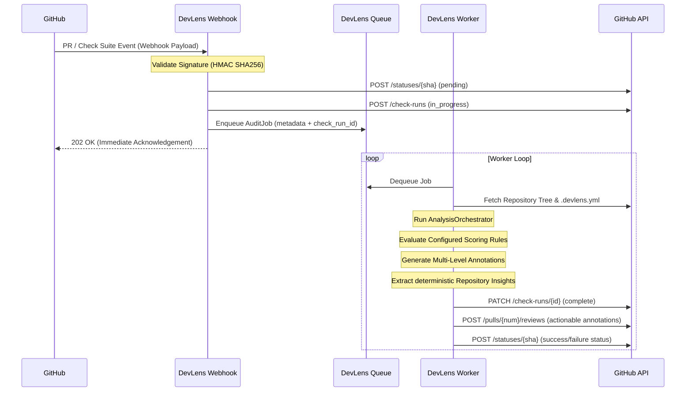

# GitHub App Architecture

This document specifies the end-to-end architecture of DevLens V3 as a first-class GitHub App integration.

## Integration Diagram

## Security & Scopes
DevLens operates under a least-privilege permission model:

| Permission | Scope | Rationale |
|---|---|---|
| **Checks** | Read & Write | Required to create check runs, upload annotation marks, and update pass/fail conclusions. |
| **Pull Requests** | Read & Write | Required to analyze code modifications, post inline review comments, and submit reviews. |
| **Commit Statuses** | Read & Write | Required to publish gating build statuses for pull request merge checks. |
| **Contents** | Read-Only | Required to fetch manifests, Dockerfiles, workflow YAMLs, and `.devlens.yml`. |
| **Metadata** | Read-Only | Basic repository identification metadata. |

## Resiliency & State
- All background tasks are stateless.
- Tasks utilize job acknowledgments, automatic Redeliveries, and DLQ routing.
- Worker shutdowns listen to standard operating system signals (`SIGTERM`/`SIGINT`).
