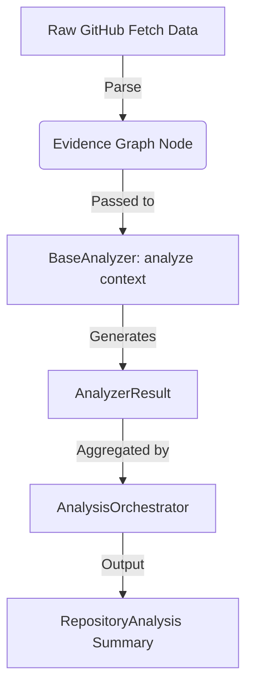

# 🧠 Iteration 1: Repository Intelligence Engine Foundation Report

This report documents the design, architecture, and validation of the deterministic **Repository Intelligence Engine (RIE)** foundation for DevLens V3.

---

## 📦 Newly Created Modules
We added a new package `app/rie/` alongside the schema contract `models/analysis.py`:

* **[analysis.py](../../../../../Side Projects/utility-projects/DevLens/backend/app/models/analysis.py)**: Defines all Pydantic dataclass contracts for `EvidenceGraph`, `AnalyzerResult`, and `RepositoryAnalysis`.
* **[base.py](../../../../../Side Projects/utility-projects/DevLens/backend/app/rie/base.py)**: Holds abstract definitions of `BaseAnalyzer` and `AnalyzerContext`.
* **[registry.py](../../../../../Side Projects/utility-projects/DevLens/backend/app/rie/registry.py)**: Orchestrates priority-sorted analyzer registers.
* **[analyzers.py](../../../../../Side Projects/utility-projects/DevLens/backend/app/rie/analyzers.py)**: Holds 10 distinct, deterministic code and document validation engines.
* **[orchestrator.py](../../../../../Side Projects/utility-projects/DevLens/backend/app/rie/orchestrator.py)**: Feeds data into the graph, runs analyzers, and outputs results.

---

## 🎨 Analyzer Architecture & Evidence Graph Design
All data is stored in the **Evidence Graph** (`EvidenceGraph` model), representing an immutable snapshot of a repository commit. 

### Decoupled Verification Plugins
Each analyzer executes purely deterministic checks using string-matching, regex searches, and file structures:
1. **MetadataAnalyzer**: Reads basic stars and name counts.
2. **ReadmeAnalyzer**: Validates prerequisites, setup commands, and screenshot URLs.
3. **LicenseAnalyzer**: Looks for open source license files.
4. **FrameworkAnalyzer**: Discovers primary languages and frameworks.
5. **DependencyAnalyzer**: Searches for package descriptors.
6. **CICDAnalyzer**: Identifies automation workflows.
7. **TestingAnalyzer**: Matches unit-testing libraries.
8. **ArchitectureAnalyzer**: Maps directories to design patterns.
9. **CommunityAnalyzer**: Validates contributing files.
10. **DeveloperExperienceAnalyzer**: Identifies local developer utilities.

---

## ✅ Test Execution Results
All RIE subsystems are fully tested and run independently of any LLM provider or external network:
* **Command**: `python -m unittest tests/test_rie.py`
* **Output**: `Ran 2 tests in 0.003s - OK`

---

## 🚀 Future Integration Strategy
In **Iteration 2**, the scoring algorithms and AI narrative generators will consume this structured `RepositoryAnalysis` schema, ensuring that LLM evaluations remain locked to deterministic evidence.

