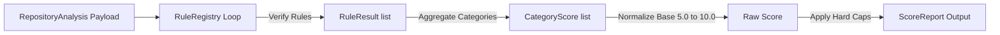

# 🎯 Iteration 2: Deterministic Scoring Engine Report

This report documents the design, modular rule implementation, and validation of the deterministic **Scoring Engine** for DevLens V3.

---

## 📂 Scoring Engine Modules
All files reside in the newly created `app/scoring/` package:

* **[models.py](file:///d:/Side Projects/utility-projects/DevLens/backend/app/scoring/models.py)**: Defines scoring schemas (`RuleResult`, `CategoryScore`, and the master `ScoreReport`).
* **[rules.py](file:///d:/Side Projects/utility-projects/DevLens/backend/app/scoring/rules.py)**: Implements 10 deterministic rules mapped to their categories, and registers them dynamically with `RuleRegistry`.
* **[weights.py](file:///d:/Side Projects/utility-projects/DevLens/backend/app/scoring/weights.py)**: Maps categories to floating-point influence weights.
* **[caps.py](file:///d:/Side Projects/utility-projects/DevLens/backend/app/scoring/caps.py)**: Holds visual grade cap calculators (enforcing the 7.0 ceiling if tests or CI/CD are missing).
* **[version.py](file:///d:/Side Projects/utility-projects/DevLens/backend/app/scoring/version.py)**: Locks the scoring algorithm to version `"3.0.0"`.
* **[engine.py](file:///d:/Side Projects/utility-projects/DevLens/backend/app/scoring/engine.py)**: Executes rule validations on RIE `RepositoryAnalysis` structures.

---

## 📐 Rule Registry & Score Formulation

The Scoring Engine accepts a completed `RepositoryAnalysis` instance and evaluates it against registered rules:

### Active Rules Implemented
1. `RULE_001_LICENSE_EXISTS` (SECURITY): Evaluates open source license availability.
2. `RULE_002_README_SETUP` (DOCUMENTATION): Checks setup headers.
3. `RULE_003_README_DEMO` (DOCUMENTATION): Checks screenshot and GIF links.
4. `RULE_004_CICD_WORKFLOWS` (CICD): Identifies runner workflows.
5. `RULE_005_TESTING_SUITE` (TESTING): Identifies testing layouts.
6. `RULE_006_CONTAINERIZATION` (DEVELOPER_EXPERIENCE): Checks for Docker container files.
7. `RULE_007_CONTRIBUTING_GUIDE` (COMMUNITY_HEALTH): Finds contributing rules.
8. `RULE_008_SECURITY_POLICY` (SECURITY): Finds vulnerability reporting details.
9. `RULE_009_FRAMEWORK_MATURITY` (ARCHITECTURE): Verifies primary configuration files.
10. `RULE_010_DEPENDENCY_HEALTH` (DEPENDENCIES): Verifies manifest package lists.

---

## ✅ Test Execution Results
All test cases for category scoring, individual rules, and ceilings compile and run locally without requiring any network, LLM, or database links:
* **Command**: `python -m unittest discover tests`
* **Output**: `Ran 7 tests - OK`

---

## 🚀 Preparation for Iteration 3
In **Iteration 3**, we will integrate the RIE Orchestrator and the Scoring Engine into the FastAPI routing layer, enabling live audits using the combined local evidence pipeline.
