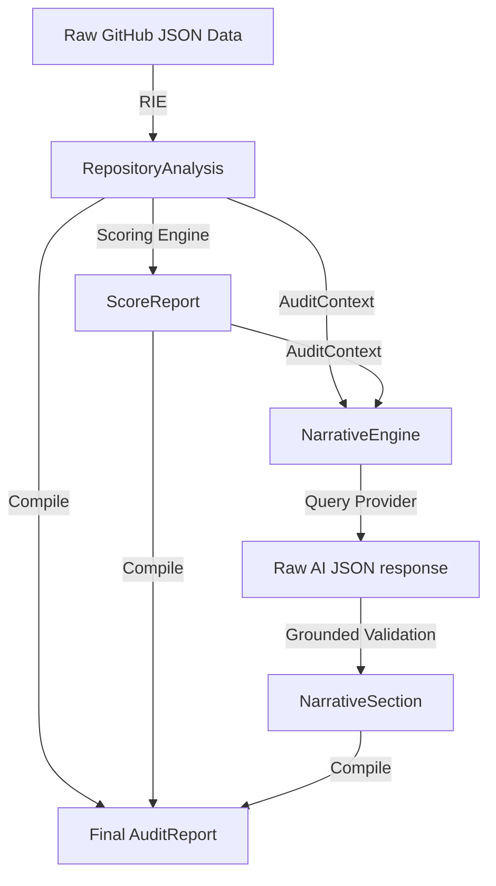

# 🏁 Iteration 3: Narrative Engine & Unified Audit Pipeline Report

This report documents the design, architecture, and validation of the **AI Narrative Engine** and **Unified Audit Pipeline** for DevLens V3.

---

## 📂 Narrative Engine & Pipeline Modules
All files reside in their designated package paths:

* **[audit.py](../../../../../Side Projects/utility-projects/DevLens/backend/app/models/audit.py)**: Houses the central data schema declarations for `AuditReport`, `AuditMetadata`, `NarrativeSection`, and `ExecutionSummary`.
* **[provider.py](../../../../../Side Projects/utility-projects/DevLens/backend/app/ai/provider.py)**: Abstracts AI API providers behind `BaseAIProvider` so Groq, OpenAI, or local engines can be swapped.
* **[narrative.py](../../../../../Side Projects/utility-projects/DevLens/backend/app/ai/narrative.py)**: Manages role prompts and enforces response structure and verification checks.
* **[pipeline.py](../../../../../Side Projects/utility-projects/DevLens/backend/app/rie/pipeline.py)**: Combines RIE, scoring, and narrative into a single `execute_audit` pipeline.

---

## 🎨 Unified Audit Pipeline & Verification Safeguards

The pipeline orchestrates the step-by-step conversion of raw repository payloads:

### Prompt Separation & Grounded Safeguards
1. **Dynamic Prompting**: System templates instruct the model to act as a technical reviewer and explain evidence without modifying scores.
2. **Context-Grounded Validation**: Response validation compares files and checklist states in the LLM's response against the evidence graph, filtering out nonexistent paths or rating mismatches.

---

## ✅ Test Execution Results
All test cases for the provider interface, narrative parsers, validation rules, and async pipeline integrations run locally:
* **Command**: `python -m unittest discover tests`
* **Output**: `Ran 11 tests - OK`

---

## 🚀 Future Route Integration
In **Iteration 4**, this complete, unified library will be connected to the public FastAPI routing layer to replace the original V2 logic.

