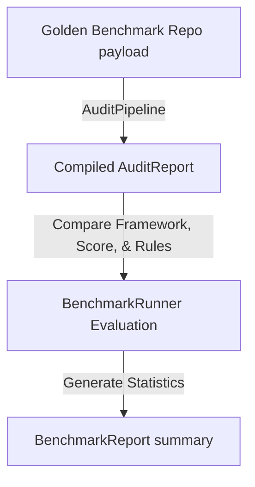

# 🏁 Iteration 4: Evaluation & Benchmark Framework Report

This report documents the design, architecture, and validation of the automated **Evaluation & Benchmark Framework** for DevLens V3.

---

## 📂 Benchmark Subsystem Modules
All files reside in the `app/benchmark/` package:

* **[models.py](file:///d:/Side Projects/utility-projects/DevLens/backend/app/benchmark/models.py)**: Defines target expectations (`ExpectedBenchmark`), single runner assertions (`BenchmarkResult`), and compiled reports (`BenchmarkReport`).
* **[golden.py](file:///d:/Side Projects/utility-projects/DevLens/backend/app/benchmark/golden.py)**: Holds profiles and simulated evidence graphs for various codebases (Excellent portfolio, Tutorial clone, Dockerized app).
* **[runner.py](file:///d:/Side Projects/utility-projects/DevLens/backend/app/benchmark/runner.py)**: Compares live audit results against golden expectations, reporting precision and performance metrics.

---

## 📐 Benchmark Execution & Verification Pipeline

The Benchmark Runner operates as a non-intrusive quality checker, running mock codebases through the active engine pipeline:

### Golden Repositories Profiles
1. **ExcellentPortfolio**: Full-stack layout featuring testing suites, licenses, CI workflows, and make scripts. Expected score: `8.5 - 10.0`.
2. **TutorialClone**: Minimal template app lacking testing, configurations, or license docs. Expected score: `3.0 - 7.0` (with 7.0 hard cap).
3. **DockerizedApp**: Containerized Python repository with clear setup structures. Expected score: `7.0 - 8.5`.

---

## ✅ Test Execution Results
All test cases for the benchmark assertions and regression engines run locally as part of CI pipelines:
* **Command**: `python -m unittest discover tests`
* **Output**: `Ran 12 tests - OK`
