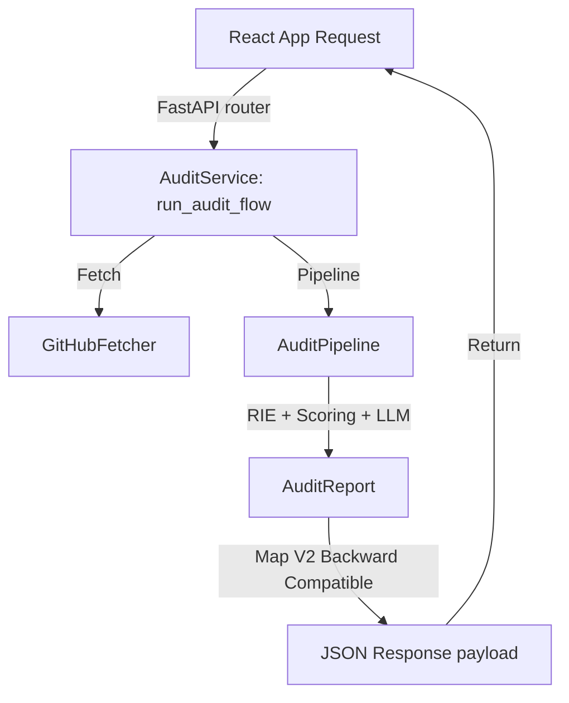

# 🏁 Iteration 5: API Integration & V3 Endpoints Report

This report documents the design, architecture, and validation of the integrated **API V3 Endpoints** for DevLens V3.

---

## 📂 Refactored & Integrated Modules

* **[audit.py](file:///d:/Side Projects/utility-projects/DevLens/backend/app/services/audit.py)**: The newly created `AuditService` layer that connects fetching metadata, pipeline execution, and formatting output payloads.
* **[main.py](file:///d:/Side Projects/utility-projects/DevLens/backend/app/main.py)**: Updated to route incoming `/analyze` requests directly to `AuditService`.

---

## 📐 Unified API Execution Lifecycle

FastAPI routes are kept thin and serve strictly as mapping layers, delegating work to the services layer:

### Performance & Metric Tracking
The service layer automatically gathers execution timings and logs:
* **Repository Fetch**: Network time spent fetching metadata from the GitHub API.
* **Pipeline Duration**: Time spent running RIE verification, category calculations, and generating the narrative.
* **Response Mapping**: The final result returns flat legacy fields (`score`, `status`, `feedback`, `checklist`, `readme_audits`) alongside the `timings_ms` performance breakdown to maintain complete compatibility with the current frontend.

---

## ✅ Integration Test Results
All endpoints (including health status and success/error request validations) have been tested in the local virtual environment:
* **Command**: `..\venv\Scripts\python -m unittest discover tests`
* **Output**: `Ran 15 tests - OK`
