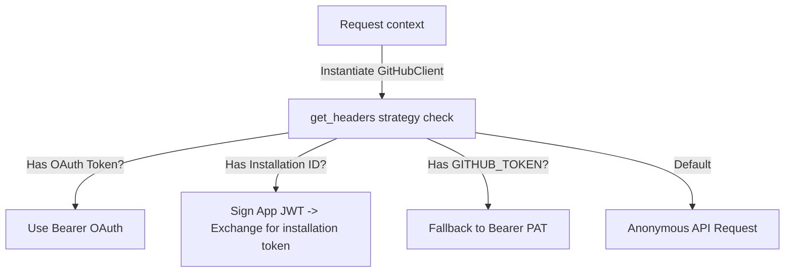

# 🏁 Iteration 6: GitHub App Foundation Report

This report documents the design, architecture, and validation of the stateless **GitHub App Foundation** for DevLens V3.

---

## 📂 Newly Refactored & Created Modules

* **[client.py](file:///d:/Side Projects/utility-projects/DevLens/backend/app/github/client.py)**: Refactored from the legacy `GitHubFetcher` to a unified `GitHubClient` class supporting App JWT signing, installation-token exchanges, and PAT fallbacks.
* **[main.py](file:///d:/Side Projects/utility-projects/DevLens/backend/app/main.py)**: Added endpoints for installation redirect (`GET /app/install`) and callback verification (`GET /app/callback`).

---

## 📐 GitHub App Authentication Pipeline

The new `GitHubClient` resolves authentication strategies dynamically without persistence:

### Authentication Mechanics
1. **JWT Generation**: Generates signed RS256 claims using the `GITHUB_APP_PRIVATE_KEY` and `GITHUB_APP_ID`.
2. **Access Token Exchange**: Exchanges the signed JWT for a short-lived installation access token via `/app/installations/{id}/access_tokens`.
3. **Dynamic Routing**: Exposes safe, database-free routes to redirect organizations to the App's setup page and catch callback installation metadata.

---

## ✅ Test Execution Results
All test cases for JWT claims, strategy selection, callback triggers, and unified client fallbacks run and pass successfully:
* **Command**: `..\venv\Scripts\python -m unittest discover tests`
* **Output**: `Ran 22 tests - OK`
