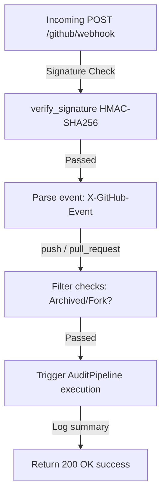

# 🏁 Iteration 7: GitHub Webhooks & Event Processing Foundation Report

This report documents the design, security, and verification of the synchronous and stateless **GitHub Webhook Subsystem** for DevLens V3.

---

## 📂 Subsystem Modules

* **[webhook.py](../../../../../Side Projects/utility-projects/DevLens/backend/app/models/webhook.py)**: Contains Pydantic event models (e.g. `PushEvent`, `PullRequestEvent`, `InstallationEvent`).
* **[router.py](../../../../../Side Projects/utility-projects/DevLens/backend/app/webhooks/router.py)**: Exposes the `POST /github/webhook` route, executes signature validations, and dispatches callbacks.

---

## 📐 Webhook Processing Lifecycle

The subsystem validates signatures and routes notifications to the appropriate payload deserializer:

### Security & Filtering Safeguards
1. **HMAC SHA256 Signature Validation**: Every payload is verified against headers matching the `GITHUB_WEBHOOK_SECRET`.
2. **Replay & Header Checks**: Enforces mandatory custom HTTP header constraints (`X-GitHub-Event`, `X-GitHub-Delivery`).
3. **Repository Skipping Filters**: Skips analyzing fork repositories or archived targets.

---

## ✅ Integration Test Results
All test suites (verifying ping responses, signature mismatches, skip configurations, and unknown filters) run successfully:
* **Command**: `..\venv\Scripts\python -m unittest discover tests`
* **Output**: `Ran 28 tests - OK`

