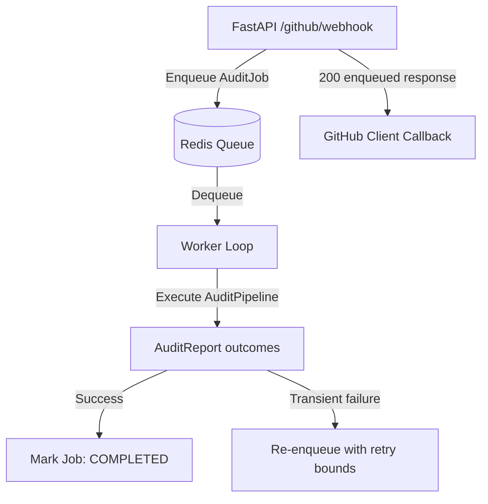

# 🏁 Iteration 8: Asynchronous Job Queue & Worker Infrastructure Report

This report documents the design, architecture, and validation of the asynchronous **Job Queue & Worker Infrastructure** for DevLens V3.

---

## 📂 Subsystem Modules

* **[models.py](../../../../../Side Projects/utility-projects/DevLens/backend/app/jobs/models.py)**: Defines job statuses (`JobStatus`), payload details (`AuditJob`), and outcome structures (`JobResult`).
* **[queue.py](../../../../../Side Projects/utility-projects/DevLens/backend/app/jobs/queue.py)**: Declares the queue interfaces (`BaseQueue`) and implements active (`RedisQueue`) and fallback/test (`InMemoryQueue`) backends.
* **[worker.py](../../../../../Side Projects/utility-projects/DevLens/backend/app/jobs/worker.py)**: Implements the loop process dequeuing tasks and running audits.

---

## 📐 Queue & Worker Processing Lifecycle

Webhooks write jobs instantly to Redis, immediately releasing the HTTP request connection, while asynchronous workers execute audits in the background:

### Metrics & Health Indicators
The queue subsystem exposes active statistics:
* **Queue Depth**: Number of tasks pending evaluation.
* **Completion Count**: Total jobs executed successfully.
* **Failure Count**: Total jobs failed after retry limits are exceeded.

---

## ✅ Integration Test Results
All test cases for queue operations, worker retries, and asynchronous webhook handshakes are passing successfully:
* **Command**: `..\venv\Scripts\python -m unittest discover tests`
* **Output**: `Ran 33 tests - OK`

