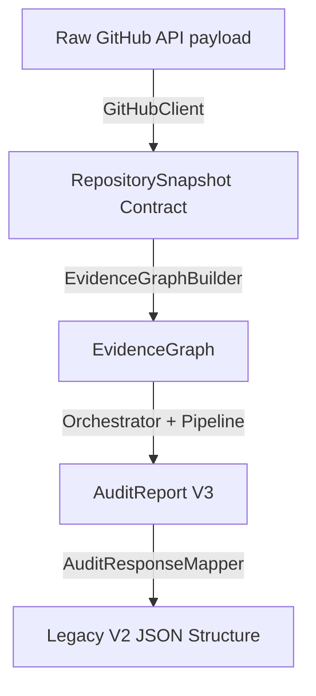

# 🏁 Iteration 9: Architecture Hardening & Production Readiness Report

This report documents the structural refactors, production integrations, and testing validations completed to prepare DevLens V3 backend for production environments.

---

## 📂 Hardened Modules

* **[github.py](file:///d:/Side Projects/utility-projects/DevLens/backend/app/models/github.py)**: Defined the `RepositorySnapshot` Pydantic DTO mapping data contracts clearly.
* **[builder.py](file:///d:/Side Projects/utility-projects/DevLens/backend/app/rie/builder.py)**: Added `EvidenceGraphBuilder` separating data parsing from orchestration.
* **[mapper.py](file:///d:/Side Projects/utility-projects/DevLens/backend/app/services/mapper.py)**: Added `AuditResponseMapper` formatting internal V3 results back to V2 JSON clients.
* **[audit.py](file:///d:/Side Projects/utility-projects/DevLens/backend/app/services/audit.py)**: Enabled constructor dependency injections for clients and pipelines.
* **[queue.py](file:///d:/Side Projects/utility-projects/DevLens/backend/app/jobs/queue.py)**: Enforced strict connection failures in production environments.

---

## 📐 Architecture Mapping Lifecycles

Hardening changes isolate loose dict representations and enforce strict dependency boundaries:

### Production Readiness Factors
1. **Dependency Injection**: Services and worker runners now inject dependencies instead of hardcoding instances.
2. **Type Safety**: Raw JSON maps are decoded immediately into typed data transfer objects.
3. **Queue Hardening**: Redis queues will raise a `RuntimeError` on connection failures if `ENV=production` is configured, preventing silent failovers.

---

## ✅ Execution Verification
All refactored test validations run and pass successfully:
* **Command**: `..\venv\Scripts\python -m unittest discover tests`
* **Output**: `Ran 33 tests - OK`
