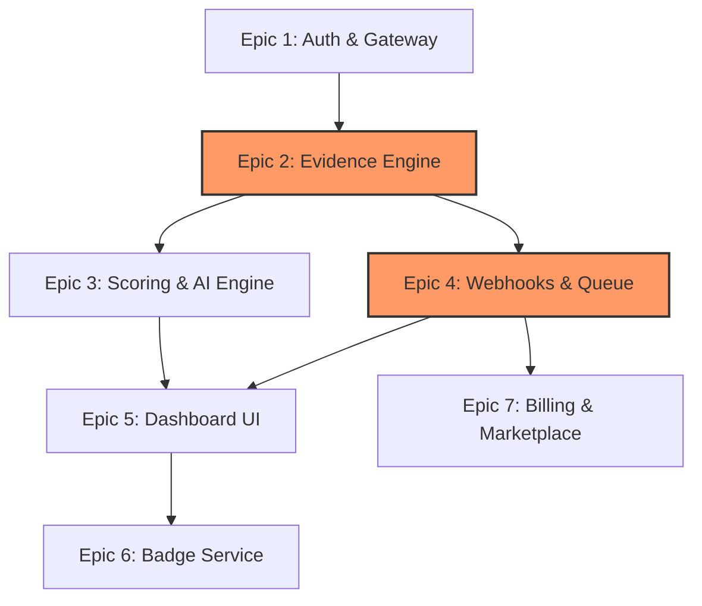

# 🗓️ DevLens V3: Master Implementation Plan

This execution plan translates the product vision, requirements, and design specifications of DevLens V3 into an engineering roadmap.

---

## 1. Milestones

```text
  ┌────────────────────────────────────────────────────────┐
  │                 MILESTONE PIPELINE                     │
  └───────┬───────────────────┬────────────────────┬───────┘
          │                   │                    │
    ┌─────▼─────┐       ┌─────▼─────┐        ┌─────▼─────┐
    │    M0     │ ───>  │    M1     │  ───>  │    M2     │
    │Foundation │       │Core Plat. │        │RIE Engine │
    └───────────┘       └───────────┘        └───────────┘
                                                   │
    ┌───────────┐       ┌───────────┐        ┌─────▼─────┐
    │    M5     │ <───  │    M4     │  <───  │    M3     │
    │Actions CI │       │ Dashboard │        │GitHub App │
    └─────┬─────┘       └───────────┘        └───────────┘
          │
    ┌─────▼─────┐       ┌───────────┐
    │    M6     │ ───>  │    M7     │
    │Marketplace│       │Release V3 │
    └───────────┘       └───────────┘
```

* **M0 - Foundation**: Establish local dockerized services, PostgreSQL schema migrations, and API gateway routing.
  * *Exit Criteria*: Successful execution of backend test suites, connection with running Redis instances, and working Postgres instances.
* **M1 - Core Platform**: Build User OAuth services, Auth session JWT issuing, and base models.
  * *Exit Criteria*: User logins successfully redirect to secure dashboard tokens.
* **M2 - Repository Intelligence Engine (RIE)**: Implement the Evidence Collection Graph and local deterministic analyzer plugins.
  * *Exit Criteria*: Verification of directory files, config structures, and markdown readmes without LLM dependencies.
* **M3 - GitHub App & Webhook Integration**: Create Webhook signature parsers and connect event pipelines to Celery task workers.
  * *Exit Criteria*: A GitHub push event triggers an automatic background worker audit job.
* **M4 - Dashboard UI**: Connect the decoupled front-end Views, hooks, and bento scorecard metrics.
  * *Exit Criteria*: Interactive rendering of dynamic scorecard lists and bento panels from active audits.
* **M5 - GitHub Actions Integration**: Launch integration runner templates posting status status checks back to PR commits.
  * *Exit Criteria*: Success status badge updates on commit status checks during PR actions.
* **M6 - Marketplace Readiness**: Support Stripe/Marketplace subscription plans and add Privacy Policy, Terms of Service, and support routes.
  * *Exit Criteria*: Passing GitHub Marketplace validation test scopes.
* **M7 - Public Release**: Deploy to Vercel/AWS production systems.
  * *Exit Criteria*: Active production checks working on the live URL.

---

## 2. Epics

1. **Epic 1: Auth & Gateway Setup** (Size: M, Risk: Low): Establish PostgreSQL schemas, user JWT cookies, and rate-limiting proxies.
2. **Epic 2: Evidence Collection Engine** (Size: L, Risk: Medium): Connect RIE directories, package manifest readers, and parser tests.
3. **Epic 3: Scoring & AI narrative Engine** (Size: M, Risk: Medium): Establish versioned penalty score rules, logic scratchpads, and structured Groq integrations.
4. **Epic 4: GitHub Webhooks & Queue Worker** (Size: L, Risk: High): Setup Celery brokers, HMAC validation check filters, and commit event mapping.
5. **Epic 5: Dashboard Frontend UI** (Size: M, Risk: Low): Build responsive React view frames, task loaders, and historic analytics charts.
6. **Epic 6: Badge Generation Service** (Size: S, Risk: Low): Create stateless cached badge endpoints serving SVG metrics.
7. **Epic 7: Enterprise Billing & Marketplace** (Size: L, Risk: Medium): Listen to Stripe and Marketplace purchase webhook events.

---

## 3. User Stories

### Story 1: GitHub App Webhook Integration
* **Description**: As a system integrator, I want to receive push and pull request notifications so that repositories are audited on code changes.
* **Acceptance Criteria**:
  * Gateway routes `/webhooks/github` requests securely.
  * Rejects signatures matching invalid tokens.
  * Saves commit hashes and queues background worker tasks.
* **Priority**: High (Points: 5)

### Story 2: Async Background Worker Task Execution
* **Description**: As a user, I want audits to run asynchronously so that my dashboard does not timeout during complex code evaluations.
* **Acceptance Criteria**:
  * Trigger returns task UUID with status `ACCEPTED`.
  * Background worker runs RIE pipeline.
  * Dashboard polls status until completed.
* **Priority**: High (Points: 8)

---

## 4. Task Breakdown

### Task 1: Webhook HMAC Middleware Implementation
* **Backend**: Build a signature verification filter in `audit-service`.
* **Testing**: Assert signature validation blocks incorrect hashes.
* **Est. Time**: 1 day.

### Task 2: Celery Redis Worker Setup
* **Infrastructure**: Create `docker-compose.yml` specifying Celery nodes and Redis instances.
* **Backend**: Connect worker modules importing RIE execution functions.
* **Est. Time**: 1 day.

---

## 5. Dependency Graph


*Note: Critical Path runs through **Epic 2 (Evidence Engine)** and **Epic 4 (Webhooks & Queue)**.*

---

## 6. Weekly Development Iterations

* **Iteration 1 (Week 1)**: Database schemas initialized, Docker compose setups launched, API Gateway routes completed.
* **Iteration 2 (Week 2)**: RIE metadata and dependency collection parsers functional.
* **Iteration 3 (Week 3)**: Celery workers connected, webhook event signature checks passing.
* **Iteration 4 (Week 4)**: React client routers implemented, dashboard bento score views connected.

---

## 7. GitHub Project Board & Standards

* **Columns**: `Backlog` -> `Ready` -> `In Progress` -> `Review` -> `Testing` -> `Done` -> `Blocked`.
* **Branch Names**: `feature/epic-name-description`, `bugfix/issue-description`, `release/vX.Y.Z`.
* **Commit Conventions**: Conventional Commits (e.g. `feat(auth): implement JWT signature checks`, `fix(worker): handle rate limit status responses`).

---

## 8. Testing Strategy

* **Unit Tests**: Coverage checking individual manifest parsers.
* **Integration Tests**: Execute Celery tasks and mock API responses.
* **Contract Tests**: Validate the RIE payload format meets the Scoring Engine contract.
* **Performance Tests**: Verify badge fetch endpoints return under load (`<100ms`).

---

## 9. Definition of Done (DoD)

### Task Level
- [ ] Code builds cleanly without warnings.
- [ ] Unit tests pass with `>80%` code coverage.
- [ ] Linting and formatting rules validated.

### Story Level
- [ ] All associated tasks are complete and verified.
- [ ] Acceptance criteria checked and validated.
- [ ] Code review completed by another developer.

---

## 10. Development Order

1. **API Gateway & Auth-Service (Epic 1)**: Needed to validate all downstream routing and user authorization cookies.
2. **Evidence Collection Engine (Epic 2)**: Core repository scanner that populates the Evidence Graph database/cache payload.
3. **Scoring Engine (Epic 3)**: Resolves deterministic audit evaluations based on the output of the Evidence Engine.
4. **Queue Worker (Epic 4)**: Connects the RIE to background pipelines.
5. **Dashboard UI (Epic 5)**: Requires working Auth and Audit API routes to render.
6. **Badge & Actions Services (Epic 6 & 7)**: Depends on complete scoring configurations and webhook triggers.
