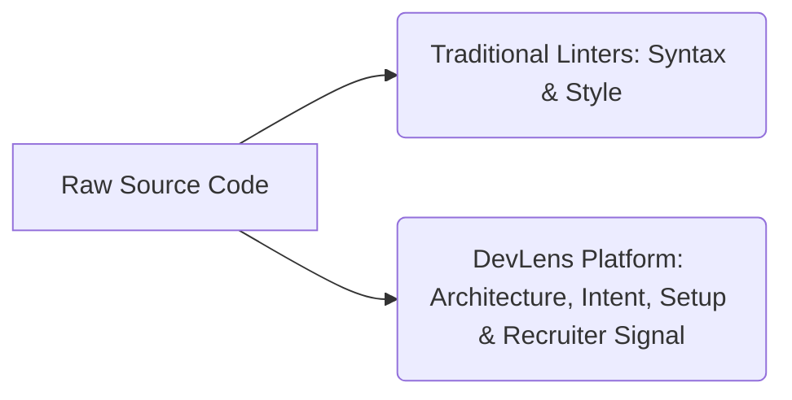

# 💡 DevLens: Product Vision

This document outlines the strategic vision, core identity, and guiding principles of **DevLens** as it evolves from a repository auditing script into the industry-standard **Repository Intelligence Platform**.

---

## 1. Core Identity & Mission

### Mission
To bridge the gap between technical execution and professional evaluation, providing developers, recruiters, and engineering teams with objective, automated, and actionable repository intelligence.

### Vision
To become the definitive hiring mirror and compliance dashboard for the global developer ecosystem, natively integrated into every GitHub organization.

---

## 2. Core Philosophy & Value Proposition

DevLens is built on the belief that code is more than a list of syntax files; it is a developer's professional resume. Traditional evaluation processes rely on either subjective human reviews (which are slow and prone to bias) or basic syntax linter reports (which measure rules but miss structure, setup guides, and project context). DevLens quantifies these qualitative aspects.

---

## 3. What DevLens IS vs. What DevLens is NOT

| What DevLens IS | What DevLens is NOT |
| :--- | :--- |
| **A Repository Auditing & Scoring Engine**: Evaluates architecture, documentation standards, and deployment indicators. | **A Code Hosting Platform**: Will never host or replicate Git repository storage. |
| **An Engineering Mentor**: Provides targeted, contextual feedback on how developers can make their portfolio recruiters-ready. | **An IDE or Editor Replacement**: Will not edit source code or act as an in-browser IDE. |
| **A Recruiter Vibe Check Tool**: Helps recruiters interpret complex file trees as clear, standardized hireability scores. | **A Static Linting Tool**: Does not focus on simple style violations (e.g., tabs vs. spaces). |
| **A Developer-Native Dashboard**: Natively integrates with GitHub actions, status badges, and Webhooks. | **A Project Management Tool**: Does not track agile velocity, sprints, or issue backlogs. |

---

## 4. Guiding Principles

### Design Principles
1. **Glassmorphic Premium Aesthetic**: Interfaces must feel premium, modern, and highly interactive. Hover states, micro-animations, and fluid transitions are standard.
2. **Context-First Visuals**: Complex metrics should be visualized using bento-grid modules, collapsible logs, and dynamic count-up animations to make technical summaries scan-friendly.
3. **Low Cognitive Load**: Make developer scores and recruitment-ready status instantly clear with simple tags (`ELITE`, `STRONG`, `POLISH`).

### Engineering Principles
1. **Deterministic Execution**: Scoring systems must be repeatable and deterministic (`temperature=0.0`). Given the same repository commit, the engine must produce the same score.
2. **API-First & Extensible**: Every UI element must map to a public API endpoint, allowing external developers to query repository statistics programmatically.
3. **Least Privilege Integration**: Request only metadata and file descriptors; avoid fetching sensitive database credentials or access logs.
4. **Resiliency over Raw Speed**: When calling third-party services (GitHub API, LLM inference endpoints), implement robust retries, rate limits, and fallback caches to handle outages gracefully.
