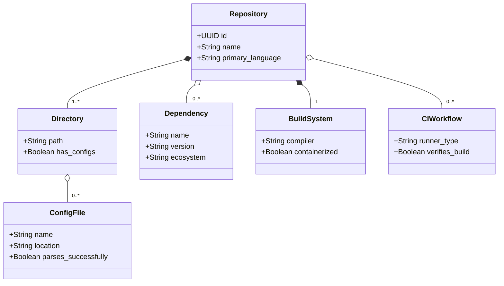
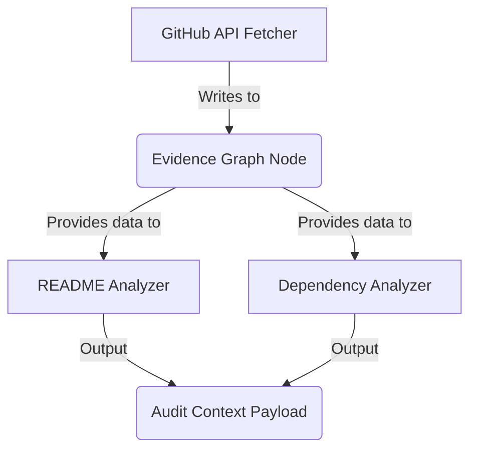

# 🧠 DevLens: Repository Intelligence Engine Specification

This specification defines the core architecture, data contracts, and verification pipelines of the **Repository Intelligence Engine** (RIE)—the foundational, deterministic intelligence system of DevLens.

---

## 1. Repository Intelligence Philosophy

The core philosophy of the Repository Intelligence Engine is **"Evidence before Evaluation."**

AI reasoning models (LLMs) are powerful but inherently non-deterministic and prone to hallucination. When directly exposed to raw source code, LLMs often miss file locations, invent dependencies, or hallucinate setup instructions. 

To eliminate these issues, DevLens decouples code discovery from reasoning:
* **The RIE is 100% Deterministic**: It acts as the evidence collector. It verifies the presence of lock files, checks configuration syntax, extracts documentation metadata, and identifies directories.
* **The AI is a Narrative Layer Only**: It never accesses raw code. It consumes only the structured, verified JSON schema produced by the RIE. It translates this evidence into readable recruiter feedback and actionable developer guides.

---

## 2. Repository Knowledge Model

The RIE models a repository as a structured graph of domain metadata, dependencies, patterns, and configuration attributes.



---

## 3. Evidence Collection Engine

The RIE collects structured indicators across multiple categories:

| Evidence Source | Purpose | Extraction Method | Reliability | Cost |
| :--- | :--- | :--- | :---: | :---: |
| **README Content** | Readme audit | Regex extraction, markdown parser | High | None |
| **Directory Tree** | Architecture detection | GitHub Tree API payload | High | None |
| **Package Manifests**| Dependency parsing | JSON/YAML parser (`package.json`, `Cargo.toml`) | High | None |
| **Docker Configurations** | Containerization check | File existence (`Dockerfile`, `docker-compose.yml`) | High | None |
| **GitHub Workflows** | CI/CD validation | Path matching (`.github/workflows/*.yml`) | High | None |
| **License Metadata** | Licensing audit | Path matching (`LICENSE`, `COPYING`) | High | None |
| **Git Commit History**| Velocity check | Git log commits retrieval | Medium | Low |

---

## 4. Analyzer Framework

Analyzers are decoupled verification plugins. Each runs independently, reading inputs from the shared Evidence Graph.

```python
class RepositoryAnalyzer(ABC):
    @property
    @abstractmethod
    def priority(self) -> int: pass

    @abstractmethod
    def analyze(self, graph: EvidenceGraph) -> AnalysisResult: pass
```

### 4.1 Required Analyzers
* **README Analyzer**: Evaluates setup, descriptions, badges, and screenshot references.
* **Architecture Analyzer**: Analyzes package directory designs (e.g. MVC, Clean Architecture).
* **Testing Analyzer**: Verifies presence of testing suites (Jest, PyTest, JUnit).
* **CI/CD Analyzer**: Detects continuous integration workflow actions.
* **Security Analyzer**: Audits `SECURITY.md`, secret detection configs, and locks.
* **License Analyzer**: Validates license file headers.
* **Dependency Analyzer**: Parses package manifests for dependency counts and vulnerability locks.
* **Community Health**: Evaluates contribution guides (`CONTRIBUTING.md`) and issue templates.
* **Release Quality**: Inspects GitHub releases and tags.
* **Developer Experience (DX)**: Verifies presence of local setup automation (`Makefile`, `taskfile`, devcontainer configs).

---

## 5. Evidence Graph & Dependency Management

Analyzers do not make redundant API calls to GitHub. They share a stateful, read-only cache structure called the **Evidence Graph**.



### 5.1 Lifecycle & Invalidation
* **Scope**: Evaluated per commit SHA.
* **Caching**: Results are stored in Redis using the key pattern `evidence:{repo_id}:{commit_sha}`.
* **Invalidation**: New commit pushes invalidate previous evidence nodes, triggering a re-audit of modified paths only.

---

## 6. Scoring Engine Inputs

To guarantee objective scores, the Scoring Engine **never** queries the raw repository directly. It accepts only a validated JSON schema containing aggregated analyzer verdicts.

### 6.1 Input Schema Contract
```json
{
  "scoring_schema_version": "3.0.0",
  "repository_id": "8f8b898a-211a-4d2c-88ab-f19b8849b290",
  "commit_sha": "a1b2c3d4e5f6g7h8i9j0",
  "analysis_timestamp": "2026-07-03T01:30:00Z",
  "analyzers": {
    "license": { "has_valid_license": true, "license_type": "MIT" },
    "readme": { "has_setup_guide": true, "has_visual_demo": false },
    "testing": { "has_tests": true, "framework": "pytest", "test_file_count": 8 },
    "cicd": { "has_ci_workflows": true, "engine": "github_actions" },
    "dependency": { "ecosystem": "npm", "outdated_count": 0 }
  }
}
```

---

## 7. AI Narrative & Reasoning Layer

The AI's sole responsibility is **explanation and translation**, not scoring.

```text
┌────────────────────────┐      ┌────────────────────────┐      ┌────────────────────────┐
│  Evidence Graph JSON   │ ───> │  AI Translation Prompt │ ───> │  Human-Readable Score  │
│ (Strictly Deterministic)│      │  (Zero Hallucination)   │      │   and Priority Guides   │
└────────────────────────┘      └────────────────────────┘      └────────────────────────┘
```

### 7.1 Safeguards Against Hallucination
* **Evidence Grounding**: The system prompt forces the LLM to write feedback matching the input JSON keys.
* **No Score Modifiers**: The LLM output does not change the final score value.
* **JSON Schema Enforcement**: Outputs are validated against Pydantic models. Any LLM response that introduces unverified assertions is rejected.

---

## 8. Extensibility & Registry

New analyzers are registered dynamically using Python entrypoints or an environment-loaded class list:

```python
# registry.py
ANALYZER_REGISTRY = [
    ReadmeAnalyzer,
    ArchitectureAnalyzer,
    DependencyAnalyzer,
    # Future custom analyzers can be appended here
]
```
This pluggable registry allows third-party developers to contribute specialized testing, documentation, or compliance checks without modifying the core pipeline orchestration.
