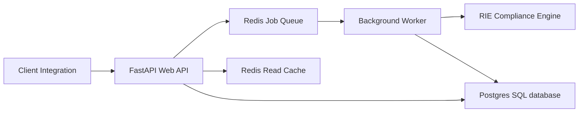

# DevLens Scalability Architecture

DevLens relies on a multi-service distributed architecture designed to scale seamlessly under heavy concurrent workloads.

---

## 1. Observability Integration Map

---

## 2. Request Context Propagation
We implemented request-level context propagation in [tracing.py](../backend/app/observability/tracing.py):
- Uses Python `contextvars` to pass trace tokens across async loops.
- Automatically correlates HTTP requests, background tasks, and SQL sessions.

---

## 3. Redis Circuit Breaker
If the Redis cache or queue container goes down, a built-in circuit breaker automatically redirects operations to local in-memory alternatives, preserving application availability.

