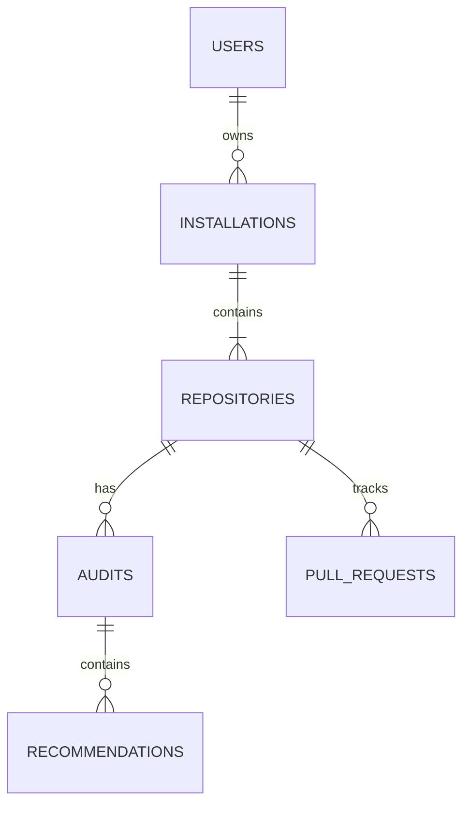
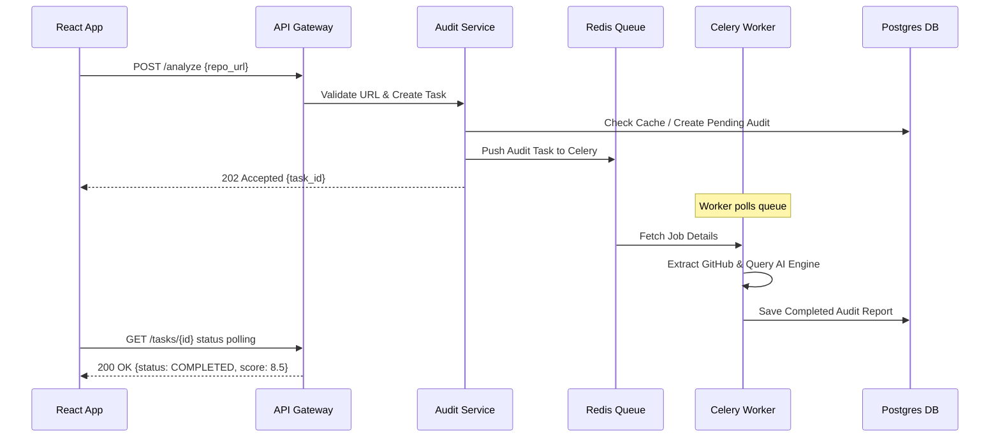

# 🛡️ DevLens V3: Technical Design Specification (TDS)

This document provides the complete Technical Design Specification (TDS) for **DevLens V3**, detailing subsystem coordination, domain models, pipeline architectures, and security designs for the platform.

---

## 1. High-Level System Architecture

DevLens V3 is a decoupled, event-driven platform optimized for high concurrency, low latency, and deterministic evaluations.

```text
                               ┌─────────────────┐
                               │  Frontend App   │
                               └────────┬────────┘
                                        │ (HTTPS / WSS)
                               ┌────────▼────────┐
                               │   API Gateway   │
                               └────────┬────────┘
             ┌──────────────────────────┼─────────────────────────┐
             │                          │                         │
    ┌────────▼────────┐        ┌────────▼────────┐       ┌────────▼────────┐
    │  Auth Service   │        │  Audit Service  │       │  Badge Service  │
    └────────┬────────┘        └────────┬────────┘       └────────┬────────┘
             │                          │                         │
    ┌────────▼──────────────────────────▼─────────────────────────▼────────┐
    │                      Redis (Cache & Task Broker)                     │
    └───────────────────────────────────┬──────────────────────────────────┘
                                        │
                               ┌────────▼────────┐
                               │ Celery Workers  │
                               └────────┬────────┘
             ┌──────────────────────────┴─────────────────────────┐
             │                          │                         │
    ┌────────▼────────┐        ┌────────▼────────┐       ┌────────▼────────┐
    │  GitHub Client  │        │  AI Groq Engine │       │ PostgreSQL (DB) │
    └─────────────────┘        └─────────────────┘       └─────────────────┘
```

### 1.1 Subsystem Responsibilities
* **Frontend**: Responsive React Client displaying dashboard views, count-up animations, and priority items.
* **API Gateway**: Reverse proxy directing route traffic to appropriate microservices and enforcing rate limits.
* **Auth Service**: Handles OAuth exchanges, session tokens, JWT signatures, and user profiles.
* **Audit Service**: Receives webhooks, queues task payloads, and coordinates analysis reports.
* **Badge Service**: A high-efficiency, stateless worker that serves score badges directly from a Redis cache.
* **Redis Broker/Cache**: Handles asynchronous background queues (Celery) and caches database entities.
* **Celery Workers**: Distributed Python agents carrying out repository extraction and analysis.
* **GitHub Client**: Encapsulates JWT signature generation and fetches repository data on behalf of installations.
* **AI Groq Engine**: Handles prompts and enforces JSON formats from LLM models.
* **PostgreSQL Database**: The primary system of record for accounts, installations, repositories, and historical audits.

---

## 2. Domain Model



### 2.1 Major Entities & Columns
* **User**: `id (UUID)`, `github_id (BigInt)`, `username (VarChar)`, `email (VarChar)`, `created_at`.
* **Installation**: `id (UUID)`, `installation_id (BigInt)`, `account_name`, `suspended (Bool)`.
* **Repository**: `id (UUID)`, `github_repo_id (BigInt)`, `name`, `full_name`, `is_private (Bool)`.
* **Audit**: `id (UUID)`, `repository_id (UUID)`, `commit_sha`, `score (Numeric)`, `status`, `metrics (JSONB)`.
* **Pull Request**: `id (UUID)`, `repository_id (UUID)`, `number (Int)`, `title`, `audit_status`.

---

## 3. Event Flows

### 3.1 Public Repository Audit (Anonymous)


### 3.2 GitHub OAuth Login
* **Trigger**: Click "Sign in with GitHub".
* **Services**: Auth-Service, GitHub OAuth API.
* **Flow**: Client redirects to `github.com/login/oauth/authorize`. GitHub redirects to callback `/auth/callback?code=...`. Auth service exchanges code for user token, upserts User in DB, and returns JWT cookie.

### 3.3 GitHub App Installation
* **Trigger**: Admin installs DevLens App on a GitHub Organization.
* **Services**: GitHub App Gateway, Audit-Service.
* **Flow**: GitHub posts `installation.created` webhook event. Audit service verifies webhook secret, creates `installation` and `repository` records, and queues initial audits.

### 3.4 Push Event (Webhook)
* **Trigger**: Developer pushes commits to default branch.
* **Services**: Gateway, Audit-Service, Celery Worker, Database.
* **Flow**: Webhook payload received -> HMAC signature verified -> Commit details checked -> Audit task queued -> Results written to DB.

### 3.5 Pull Request Event
* **Trigger**: PR opened or updated.
* **Services**: Audit-Service, GitHub API.
* **Flow**: Webhook event queues worker -> Code diffs analyzed -> Score posted as a GitHub commit status check / PR comment.

### 3.6 Scheduled Nightly Audit
* **Trigger**: Cron timer triggers daily (e.g. at 03:00 UTC).
* **Flow**: Audit service identifies all active repositories and triggers worker tasks to verify that dependency links and readmes remain fresh.

### 3.7 Badge Request
* **Trigger**: Markdown image render on GitHub page.
* **Services**: Badge Service, Redis Cache.
* **Flow**: Endpoint matches `/badge/{repo_id}`. Reads cached score from Redis. Returns styled SVG directly in `<50ms`.

### 3.8 Dashboard Loading
* **Trigger**: User opens dashboard page.
* **Flow**: Client queries `/dashboard/repositories`. Returns user-owned installations and latest audit summaries from Postgres.

---

## 4. Repository Analysis Pipeline

The audit pipeline is divided into independent, sequential verification steps.

```text
┌──────────────┐      ┌─────────────────┐      ┌─────────────┐      ┌─────────────┐
│ 1. Discovery │ ───> │ 2. Meta Fetch   │ ───> │ 3. README   │ ───> │ 4. FileTree │
└──────────────┘      └─────────────────┘      └─────────────┘      └─────────────┘
                                                                           │
┌──────────────┐      ┌─────────────────┐      ┌─────────────┐             │
│ 8. Report    │ <─── │ 7. Scoring      │ <─── │ 6. AI Groq  │ <───────────┘
└──────────────┘      └─────────────────┘      └─────────────┘
```

1. **Repository Discovery**:
   * *Inputs*: Owner and repository names.
   * *Outputs*: GitHub repository API availability.
   * *Failure Handling*: Raise 404 immediately.
2. **Metadata Collection**:
   * *Inputs*: API endpoint paths.
   * *Outputs*: Stars, update dates, license metadata.
   * *Est. Time*: 200ms.
3. **README Extraction**:
   * *Inputs*: Repository path.
   * *Outputs*: Decoded README text.
   * *Est. Time*: 300ms.
4. **File Tree Analysis**:
   * *Inputs*: Directory structures.
   * *Outputs*: Config and package files (e.g. `package.json`, `Dockerfile`).
   * *Est. Time*: 300ms.
5. **AI Reasoning**:
   * *Inputs*: Markdown readme content + File tree list.
   * *Outputs*: JSON formatted rating criteria.
   * *Est. Time*: 2,500ms.
6. **Deterministic Scoring**:
   * *Inputs*: AI output JSON + structured file verifications.
   * *Outputs*: Numeric score (0.0 to 10.0) + audit breakdown.
   * *Est. Time*: 50ms.

---

## 5. Plugin Architecture

DevLens V3 uses independent **Analyzer Plugins** implementing a strict interface contract.

```python
class BaseAnalyzer(ABC):
    @abstractmethod
    def run(self, context: AuditContext) -> AnalyzerResult:
        """Executes verification and returns result with weight details."""
        pass
```

### 5.1 System Analyzers
* **README Analyzer** (Weight: 15%): Checks setup instruction readability and visual elements.
* **Architecture Analyzer** (Weight: 20%): Evaluates repository directories for structural design patterns.
* **Testing Analyzer** (Weight: 15%): Identifies unit-testing suites.
* **CI/CD Analyzer** (Weight: 15%): Looks for workflow files (GitHub Actions, CircleCI).
* **Security Analyzer** (Weight: 10%): Scans for security guidelines (`SECURITY.md`).
* **License Analyzer** (Weight: 10%): Verifies license presence and compliance.
* **Dependency Analyzer** (Weight: 15%): Verifies package dependency freshness.

---

## 6. Scoring Engine Specification

The scoring engine executes a versioned mathematical function based on verified weights:

$$\text{Final Score} = \min(10.0, \max(0.0, 5.0 + \sum \text{Merits} - \sum \text{Deductions}))$$

### 6.1 Penalty & Cap Rules
* **No LICENSE Penalty**: $-1.0$ point deduction.
* **Missing Tests & CI/CD Cap**: If tests and CI/CD configs are missing, the score is capped at **7.0** maximum.
* **Tutorial Clone Penalty**: $-2.0$ points if the project structure matches typical template repositories.

### 6.2 Version Management
Scoring versions are locked to the database audit payload (e.g., `scoring_version: "3.0.0"`). Updates to scoring rules do not modify historic audits, preserving historical data consistency.

---

## 7. API Specification

### 7.1 Key Endpoints (REST v3)
* `POST /v3/auth/github`: OAuth handshake callback.
* `GET /v3/repositories`: Retrieve all installed repos.
* `POST /v3/audits`: Request audit run. Returns 202 Accepted.
* `GET /v3/audits/{id}`: Fetch evaluation scorecard.
* `GET /badge/{repo_id}.svg`: Serves dynamic shields.io style XML vector files.

---

## 8. Background Jobs (Celery Tasks)

* `tasks.process_audit`:
  * *Trigger*: User request / webhook request.
  * *Retry*: Retry 3 times on GitHub API 502/503 errors.
  * *Duration*: 3–5 seconds.
* `tasks.pr_comment_reporter`:
  * *Trigger*: Pull request update webhook.
  * *Priority*: High.
* `tasks.nightly_sync`:
  * *Trigger*: Daily cron timer.
  * *Priority*: Low.

---

## 9. Security Architecture

* **OAuth & JWT**: Users authenticate via GitHub OAuth. The server responds with a signed cookie containing a HS256 JWT containing user identification.
* **Webhook Verification**: Validates all incoming events using the App secret via HMAC-SHA256 headers.
* **Secret Isolation**: Private keys are loaded into server memory variables and are never written to databases.
* **Private Repositories**: The system uses installation tokens with fine-grained read-only permissions, eliminating the need to request general repository access.

---

## 10. Future Extensibility

* **VS Code Extension**: Can call `GET /v3/audits/current` by reading the local `.git` origin URL and displaying scorecard insights inside the editor.
* **CLI Utility**: Packaged binary (`npm install -g @devlens/cli`) calling the public API to run quick local checks before committing code.
* **Chat Integrations**: Webhook handlers can format and post audit details straight to Slack or Discord channels.
