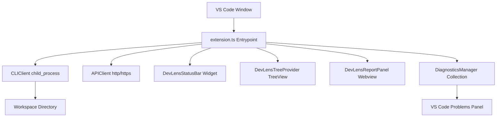

# DevLens VS Code Extension Architecture

This document describes the architectural layout, modules interaction, and runtime lifecycle of the official DevLens VS Code Extension.

---

## Architecture Blueprint

---

## Module Specifications

### 1. Main Entrypoint (`extension.ts`)
- Manages active extension lifecycle.
- Binds user command identifiers to actions, executing progress notifications during audits.

### 2. Client Layer
- **`cli.ts`**: Shell process coordinator. Spawns `devlens audit <folder> --offline --json` inside the active workspace directory. Locates the JSON block using bounding indexes to ignore traceback lines.
- **`api.ts`**: Outbound HTTP integration manager. Interacts with the FastAPI backend REST routes using Node's native HTTP/HTTPS modules to bypass external package dependencies.

### 3. Providers Layer
- **`diagnostics.ts`**: Populates file compiler markers in the IDE's Problems panel dynamically on rule failures.
- **`tree.ts`**: Populates the Explorer Side Panel with overall score metrics, verdict cards, and collapsible rules checklists.
- **`statusbar.ts`**: Renders scorecards and badges on the global status bar.
- **`webview.ts`**: Serves a sandbox Webview panel displaying HTML/CSS reports and recommendations.
